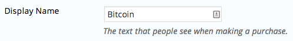

## Integration Requirements
Get started by [signing up for a BitPay merchant account.](https://bitpay.com/dashboard/signup)

You must also have already installed the [WP eCommerce plugin](https://wordpress.org/plugins/wp-e-commerce/) from the WordPress Plugin Directory.

## Installing the Plugin
1. [Download the latest release](https://github.com/bitpay/wordpress-ecommerce-plugin/releases) of the plugin and extract the contents of the zip file.

2. Copy the wpsc-merchants folder and paste it into your active WP eCommerce instance **(e.g. /var/www/html/wordpress/wp-content/plugins/wp-e-commerce).**

To install directly from GitHub, review the [guide](https://github.com/bitpay/wordpress-ecommerce-plugin/blob/master/GUIDE.md#installation-from-github) in our repository for this plugin.

Do not attempt to install this BitPay file through the WordPress plugins control panel.

## Connecting BitPay and WP eCommerce
1. Log into your WordPress admin panel and select **"Settings" > "Store" > "Payments".**

2. Check the box for **"Bitcoin Payments by BitPay"** to activate it and click **"Save Changes"** below.

3. Click **"Settings"** below the BitPay payment option.

4. Edit **"Display Name"** if desired.

5. Create a pairing code in your BitPay merchant dashboard.

6. Copy and paste this pairing code into the **"Pairing Code"** field in your WordPress plugin admin dashboard to create an API token for BitPay transactions.

7. Select **"Update"** to save all configured settings.

Nice work! Your customers will now be able to check out with bitcoin on your WordPress site.

## Advanced Setup

### Set Transaction Speed Settings
Transaction speeds can be set to "High", "Medium, or "Low". "High" speed confirmations typically take 5-10 seconds and can be used for digital goods or low-risk items. "Low" speed confirmations take about 1 hour and should be used for high-value items.

### Designate a Redirect URL
Enter the URL for the page to which customers should be directed after they have paid an invoice.
